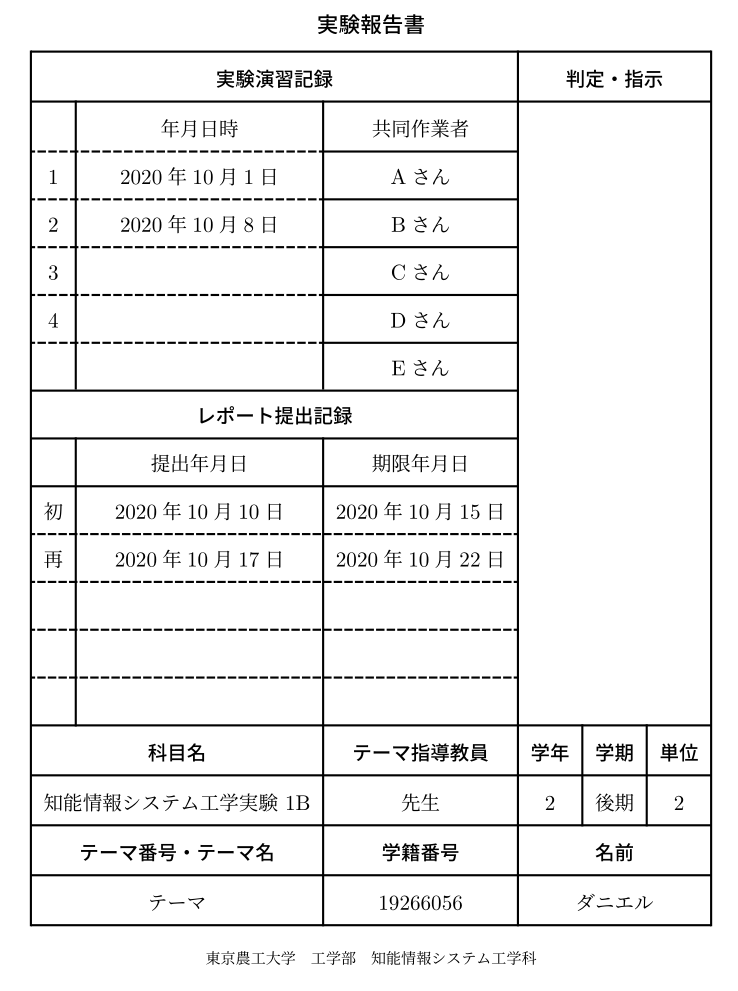

# 知能情報システム工学実験表紙(LaTeX 版)

[](https://github.com/pineapplehunter/tuat-tex/actions)



## サンプル
### platex
`sample-platex.tex`を参考にしてみてください。
### xelatex(Tectonic等)
`sample-xelatex.tex`を参考にしてください。

## 使い方

`tuatreporttitle.sty`を自分の作業ディレクトリに移動して

```latex
\usepackage{tuatreporttitle}
```

それから次のようなパラメータをプリアンプルで決めます

| 表紙設定(例)                             | 内容                                         |
| ---------------------------------------- | -------------------------------------------- |
| \title{実験報告書}                       | レポートのタイトル(指定なしで「実験報告書」) |
| \tuatgakunen{2}                          | 学年                                         |
| \tuatgakki{後期}                         | 学期                                         |
| \tuattani{2}                             | 単位                                         |
| \tuatnumber{19266056}                    | 学籍番号                                     |
| \tuattheme{テーマ}                       | テーマ                                       |
| \tuatteacher{先生}                       | 指導教員                                     |
| \tuatkamoku{知能情報システム工学実験 1B} | 科目                                         |
| \tuatauthor{ダニエル}                    | 氏名                                         |
| \date1{2020年10月10日}                   | 実験日 一日目                                |
| \date2{2020年10月10日}                   | 実験日 二日目                                |
| \date{3~5}{2020年10月10日}               | 実験日 予備                                  |
| \collaborator{1~5}{Aさん}                | 共同作業者                                   |
| \duedate1{2020年10月10日}                | 提出日期限                                   |
| \duedate2{2020年10月10日}                | 提出日期限(再)                               |
| \submitdate1{2020年10月10日}             | 提出日                                       |
| \submitdate2{2020年10月10日}             | 提出日(再)                                   |


設定ができたら document 内でこのように打ちます。

```latex
\maketitle
```

これでページに表紙が表示されるはずです。

`sample.tex`を参考にしてみてください。

## テスト環境

| 名称   | 設定                |
| ------ | ------------------- |
| LaTeX  | [Tectonic][](XeTeX) |
| サイズ | A4                  |

[tectonic]: https://tectonic-typesetting.github.io/en-US/

その他での動作は保証しませんがある程度どんな環境でも動くと思います。動かない環境があれば連絡して貰えれば対応を考えてみます。

## 参考
始めてLaTeXを書く人はTectonicというプログラムを使うことをおすすめします。私が記事を書いているので参考にしてみてください。
https://students-tech.blog/post/tectonic.html#latex%E3%81%A8%E3%81%AF

## 質問・要望

なにか質問や要望があればこのレポジトリに issue,PullRequiest を送るか、次のメールアドレスに連絡をお願いします。

s196643z@st.go.tuat.ac.jp
